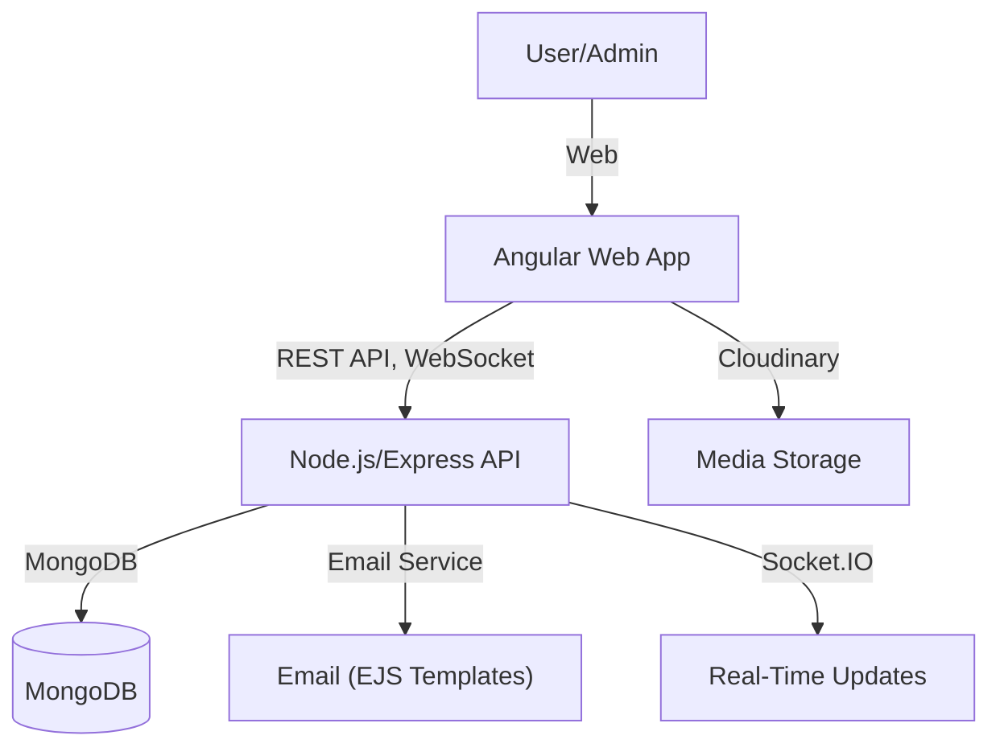
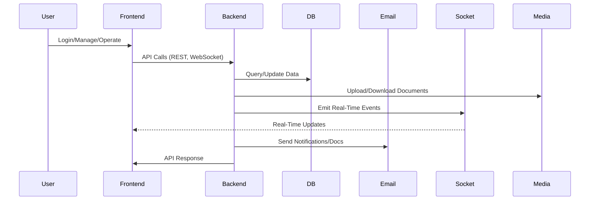
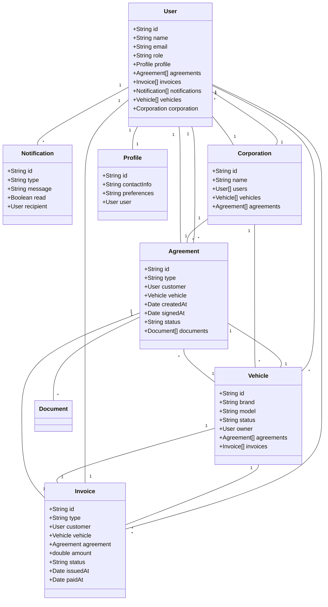

# DealerPro Platform Documentation


> **This is the definitive, unified technical and conceptual overview of DealerPro (Cardesk), integrating both frontend and backend, their data flows, relationships, and core logic.**

---

## Table of Contents
1. [Platform Overview](#platform-overview)
2. [High-Level Architecture](#high-level-architecture)
3. [Unified Data Flow](#unified-data-flow)
4. [Core Domain Model (UML)](#core-domain-model-uml)
5. [Real-Time Interactions](#real-time-interactions)
6. [Module-by-Module Deep Dive](#module-by-module-deep-dive)
7. [Security, Real-Time, and Error Handling](#security-real-time-and-error-handling)
8. [Getting Started](#getting-started)
9. [License](#license)

---

## Platform Overview

DealerPro (Cardesk) is a full-stack, enterprise-grade car dealership management platform. It provides:

- **Frontend (Angular Web App):** Admin and user interface for vehicle, customer, agreement, invoice, and profile management, with dashboards, analytics, and role-based access.
- **Backend (Node.js/Express API):** Central business logic, data storage (MongoDB), authentication, RBAC, financial operations, notifications, and real-time services.

All components communicate via secure REST APIs and WebSockets, with shared data models and business rules enforced across the stack.

---

## High-Level Architecture



---

## Unified Data Flow



---

## Core Domain Model (UML)



---

## Real-Time Interactions

DealerPro uses Socket.IO for real-time updates, such as agreement status, notifications, and invoice/payment events. Example flows:

### 1. Real-Time Agreement Status
- When an agreement is created or signed, the backend emits a socket event to relevant users/admins.
- Frontend listens and updates the UI instantly (e.g., agreement list, dashboard metrics).

### 2. Real-Time Notifications
- System events (e.g., new invoice, payment received, document uploaded) trigger backend socket events.
- Users receive instant notification popups and badge updates.

---

## Module-by-Module Deep Dive

### Frontend (Angular Web Application)
- **Authentication:** Login, signup, password reset, OTP, Google OAuth. Role-based access and route guards.
- **Dashboard:** Analytics for users and admins (vehicle stats, revenue, agreements, activity).
- **Vehicles:** Inventory management, add/edit/list, status tracking, media/document uploads.
- **Customers:** Individual and corporate customer management, profiles, segmentation, communication history.
- **Agreements:** Sales, purchase, and agency agreements; digital signature, document generation, workflow tracking.
- **Invoices:** Swish and traditional invoices, payment status, PDF generation, financial analytics.
- **Profile:** User self-service, theme management, security settings, data export.
- **Settings/Roles:** Admin role/permission management, RBAC, organization structure.
- **Notifications:** Real-time and email notifications, read/unread management.
- **Website:** Public landing page, animated, responsive, lead generation.

### Backend (Node.js/Express API)
- **Authentication & User Management:** Secure signup/login, OTP, JWT, profile, admin actions.
- **Vehicles:** CRUD, inventory, acquisition/outlay tracking, profit analysis, media uploads (Cloudinary).
- **Customers:** CRUD, segmentation, document management, agreement linking.
- **Agreements:** Sales, purchase, agency; workflow, digital signature, document storage.
- **Invoices:** Swish/traditional, payment tracking, reporting.
- **RBAC:** Role/permission management, multi-tenancy, hierarchical permissions.
- **Corporation:** Multi-org support, user/vehicle/agreement isolation.
- **Notifications:** Event-driven, socket/email, audit logging.
- **Dashboard:** Aggregated analytics, charts, activity logs.
- **File Uploads:** Cloudinary for images/docs, secure access.
- **Email:** EJS templates for agreements, OTP, password reset, notifications.

---

## Security, Real-Time, and Error Handling

- JWT authentication, RBAC, secure file uploads, audit logging, and encryption for sensitive data.
- Real-time updates via Socket.IO for agreements, notifications, and payments.
- Cloudinary stores all media securely.
- Robust error handling and logging throughout backend and frontend.

---

## Getting Started

### Prerequisites
- [Node.js](https://nodejs.org/) (v16 or higher recommended)
- [npm](https://www.npmjs.com/) (comes with Node.js)

---

### Backend Setup

1. **Navigate to the Backend directory:**
   ```sh
   cd Backend
   ```
2. **Install dependencies:**
   ```sh
   npm install
   ```
3. **Environment Variables:**
   - Copy the example environment file and update it with your configuration:
     ```sh
     cp .env.example .env
     ```
   - Edit `.env` to set your database, JWT secrets, email, and other service credentials as needed.
4. **Start the backend server (development mode):**
   ```sh
   npm run dev
   ```
   Or to start in production mode:
   ```sh
   npm start
   ```

---

### Frontend Setup

1. **Navigate to the Frontend directory:**
   ```sh
   cd Frontend
   ```
2. **Install dependencies:**
   ```sh
   npm install
   ```
3. **Environment Configuration:**
   - The frontend uses Angular environment files for configuration:
     - `src/environments/environment.ts` (for production)
     - `src/environments/environment.development.ts` (for local development)
   - Update the `BACKEND_URL`, `apiUrl`, and any other relevant keys in these files to match your backend setup.
   - Example for development (`environment.development.ts`):
     ```ts
     export const environment = {
         BACKEND_URL: "http://localhost:3000",
         apiUrl: "http://localhost:3000/api",
         RECAPTCHA_SITE_KEY: "<your-site-key>",
         RECAPTCHA_SECRET_KEY: "<your-secret-key>"
     };
     ```
   - Example for production (`environment.ts`):
     ```ts
     export const environment = {
         BACKEND_URL: "https://api.domain.com",
         RECAPTCHA_SITE_KEY: "<your-site-key>",
         RECAPTCHA_SECRET_KEY: "<your-secret-key>"
     };
     ```
4. **Start the frontend development server:**
   ```sh
   npm run dev
   ```
   The app will be available at [http://localhost:8081](http://localhost:8081)

---

### Notes
- Ensure the backend is running before using the frontend for full functionality.
- For production deployment, review and update all environment variables and configuration files as needed.
- Refer to `.env.example` in the backend and the Angular environment files in the frontend for all configurable options.

---

## License

This project is proprietary and not open source. All rights reserved.